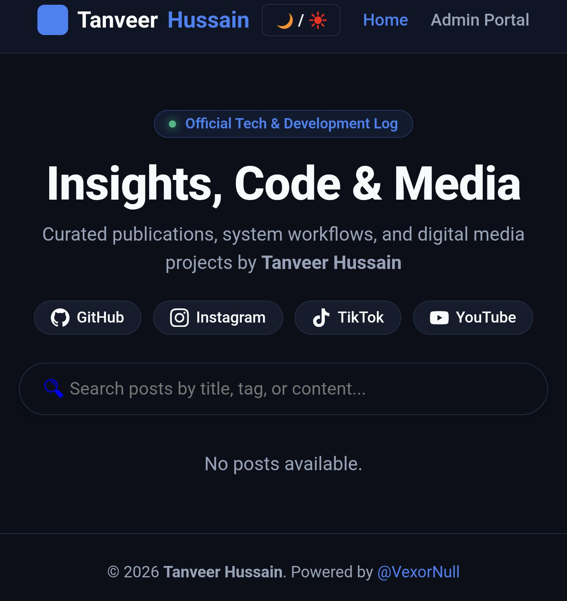

# 🚀 Tanveer Hussain (@VexorNull) — Official Web Platform

Welcome to the official repository for **Tanveer Hussain's** web platform. This platform serves as a modern, high-performance digital hub for sharing technical insights, code snippets, system workflows, and media publications.



---

## 🌐 Live Platform

Access the live website here:  
👉 **[vexornull.github.io/Tanveer-Hussain](https://vexornull.github.io/Tanveer-Hussain/)**

---

## ✨ Key Features

- **📱 Fully Responsive Design:** Clean layout optimized for mobile, tablet, and desktop viewing.
- **🌗 Light & Dark Theme Toggle:** Seamless theme switching with stored user preference.
- **⚡ Modern UI & Glassmorphism:** Sleek, minimal UI built using standard CSS custom properties.
- **🔍 Instant Post Search:** Dynamic real-time search by article titles and categories.
- **🔗 Connect Hub:** Fixed, standard social media badges linking directly to GitHub, Instagram, TikTok, and YouTube.
- **🛡️ Integrated Admin Portal:** Structured management interface for content publishing and moderation.

---

## 🛠️ Tech Stack & Architecture

- **Frontend:** HTML5, CSS3 (Custom Variables & Modern Flex/Grid Layouts)
- **Logic:** Vanilla JavaScript (ES6 Modules)
- **Deployment:** GitHub Pages
- **Social Branding:** Custom SVG vector icons with brand hover dynamics

---

## 📁 Repository Structure

```text
Tanveer-Hussain/
├── index.html          # Main landing page & publication feed
├── admin.html          # Admin portal for content management
├── styles.css          # Core styles, themes, and responsive design
├── js/
│   ├── app.js          # Dynamic UI loader & search functionality
│   └── admin.js        # Admin interaction scripts
└── assets/             # Brand logos, preview cards, and static media
│   └── admin.js        # Admin interaction scripts
└── assets/             # Brand logos, preview cards, and static media

🔗 Connect & Follow
Stay connected across official channels:
GitHub: @VexorNull
Instagram: @VexorNull
TikTok: @VexorNull
YouTube: @VexorNull
📄 License
This project is maintained by Tanveer Hussain. All rights reserved. Feel free to explore and reference the source code for educational purposes
